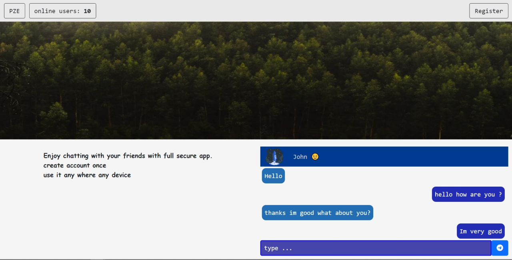
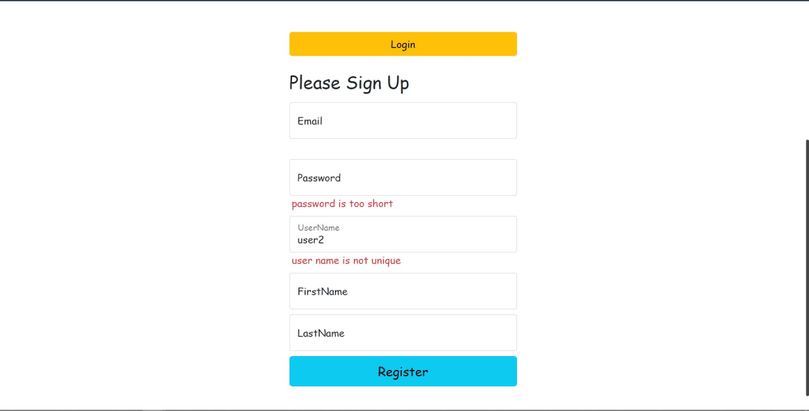
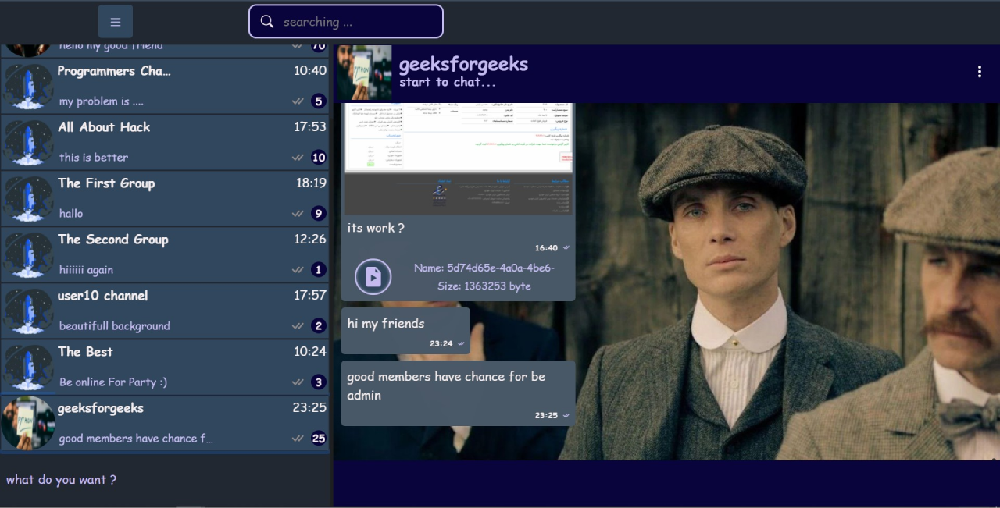
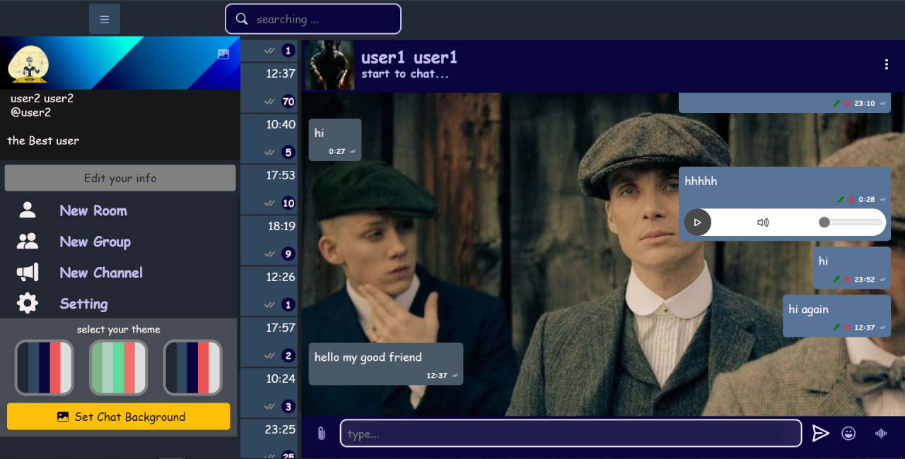
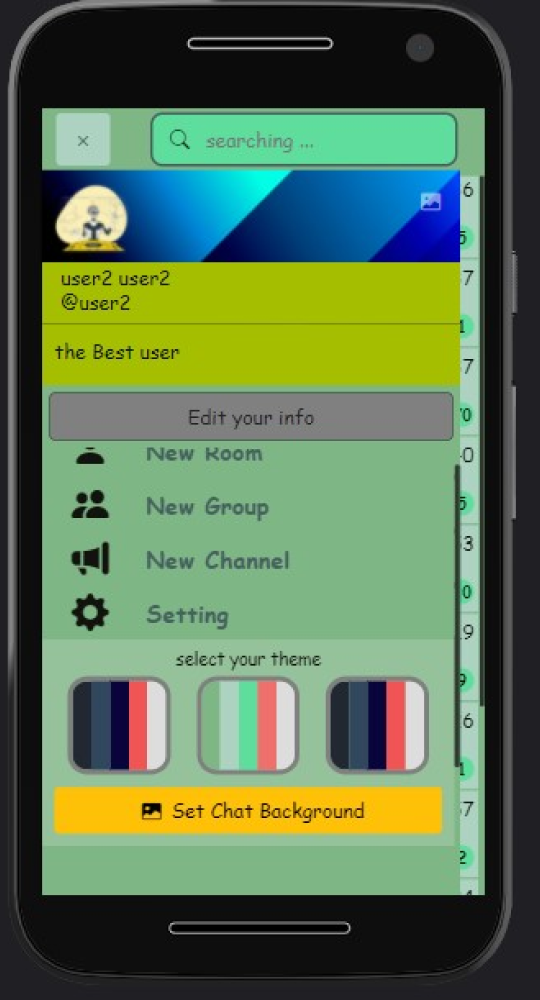
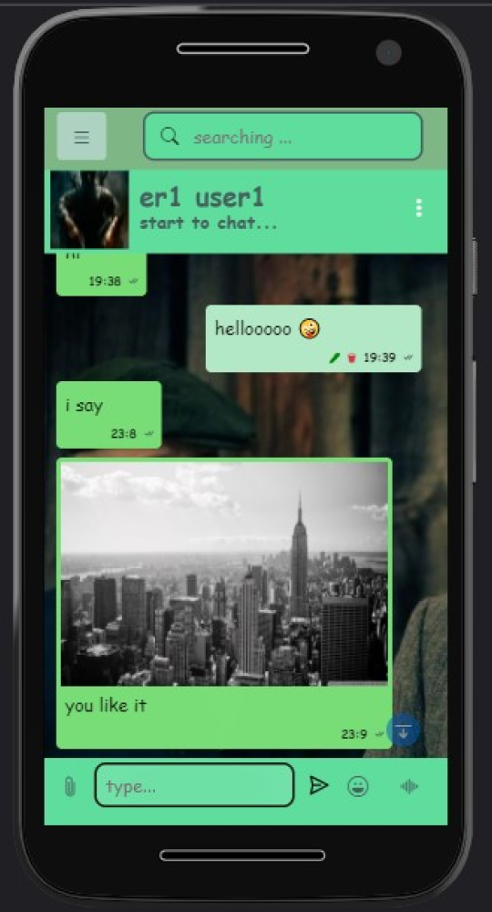

# Messenger App

Full Stack Application 
Nextjs+ Asp .net Core Web API + SignalR

## tools

-   Nextjs (Reactjs Framework)
-   Context
-   bootstrap + css( scss ) module
-   Asp .net core Web API
-   SignalR (RealTime Connection)
-   jwt authorize
-   Postgresql Database + Redis ( BackPlane )
-   Ef Core ORM

## features

-   PWA
-   Full Responsive

**for upgrading send your suggestions**

---
---

