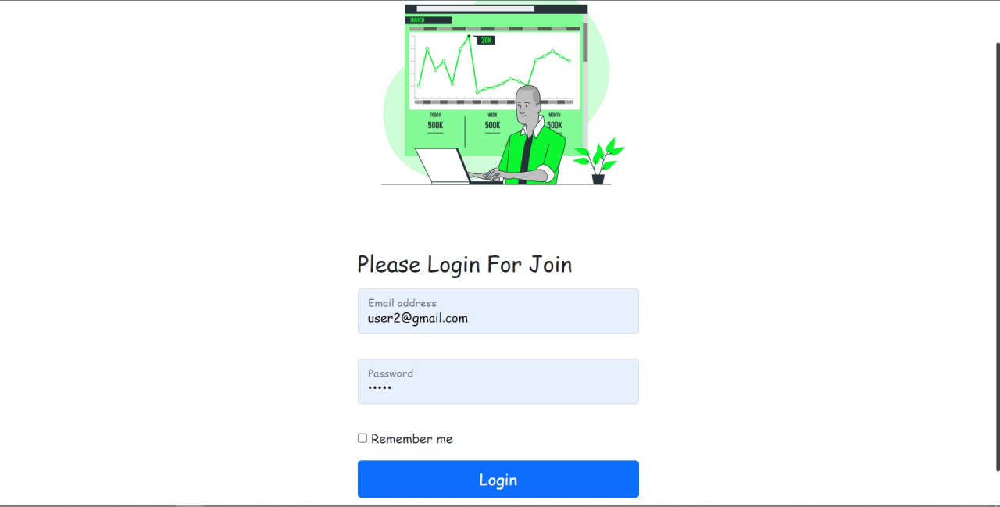
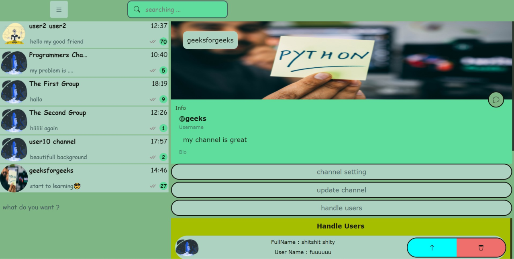

# Nextjs Messenger

Full Stack Messenger
Nextjs with Asp .net Core API + SignalR

## tools

- Nextjs (Reactjs Framework)
- Context
- bootstrap + css( scss ) module
- Asp .net core API
- SignalR (RealTime Connection)
- jwt token
- Postgresql Database + Redis ( BackPlane )
- EfCore ORM

## features

- PWA
- Full Responsive
- Like Telegram

**use it and rate it**
**for upgrading send your helps**
---

